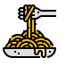
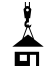

<!-- PROJECT SHIELDS -->

[![Contributors][contributors-shield]][contributors-url]
[![Forks][forks-shield]][forks-url]
[![Stargazers][stars-shield]][stars-url]
[![Issues][issues-shield]][issues-url]
[![MIT License][license-shield]][license-url]
[![LinkedIn][linkedin-shield]][linkedin-url]

<!-- PROJECT LOGO -->

# Curso Boas Praticas Programaçao

Desenvolver bom código, limpo, de fácil entendimento e ver as boas praticas do mercado

- [Trabalho em Curso](TrabalhoEmCurso)

Criar um roteiro onde o jovem padawan, aprenda a desenvolver bom codigo, limpo, testavel e funcional.

## Saiba Mais

-  [ Anti-Design Pattern](AntiDesignPattern.Md)
-  [ Divida Tecnica](DividaTecnica.Md)
-  [ Impactos do Spaghetti Code](ImpactosDoSpaghettiCode.Md)
-  [ Low Code: uma nova tendencia ](LowCode_NovaTendencia.Md)
-  [ O que é uma equipe de sustentacao](OQueEhSustenta‡ao.Md)
-  [ A origem do termo Spagheti code](SpaghetiCodeHistory.Md)
-  [ Sustentaçao em TI](Sustenta‡aoTI.Md)

-  [ Principios SOLID](AdotePrincípiosSOLIDBoasPraticasProgramacao.md)

------

### Navegue

-  [ Veja alguns tutoriais](Tutoriais)

------

#### * DIO - Digital Inovation One *
######  [Inscreva-se na Dio](https://digitalinnovation.one/sign-up?ref=R5J3ZLTIFS)  

######  [Vagner Bellacosa perfil na Dio](https://web.digitalinnovation.one/users/vagnerbellacosa?tab=achievements)  

<!-- MARKDOWN LINKS & IMAGES -->
<!-- https://www.markdownguide.org/basic-syntax/#reference-style-links -->
[contributors-shield]: https://img.shields.io/github/contributors/VagnerBellacosa/Curso_BoasPraticasProgramacao.svg?style=for-the-badge
[contributors-url]: https://github.com/VagnerBellacosa/Curso_BoasPraticasProgramacao/graphs/contributors
[forks-shield]: https://img.shields.io/github/forks/VagnerBellacosa/Curso_BoasPraticasProgramacao.svg?style=for-the-badge
[forks-url]: https://github.com/VagnerBellacosa/Curso_BoasPraticasProgramacao/network/members
[stars-shield]: https://img.shields.io/github/stars/VagnerBellacosa/Curso_BoasPraticasProgramacao.svg?style=for-the-badge
[stars-url]: https://github.com/VagnerBellacosa/Curso_BoasPraticasProgramacao/stargazers
[issues-shield]: https://img.shields.io/github/issues/VagnerBellacosa/Curso_BoasPraticasProgramacao.svg?style=for-the-badge
[issues-url]: https://github.com/VagnerBellacosa/Curso_BoasPraticasProgramacao/issues
[license-shield]: https://img.shields.io/github/license/VagnerBellacosa/Curso_BoasPraticasProgramacao.svg?style=for-the-badge
[license-url]: https://github.com/VagnerBellacosa/Curso_BoasPraticasProgramacao/blob/master/LICENSE.txt
[linkedin-shield]: https://img.shields.io/badge/-LinkedIn-black.svg?style=for-the-badge&logo=linkedin&colorB=555
[linkedin-url]: https://www.linkedin.com/in/VagnerBellacosa/
[product-screenshot]: Image/capa.png
